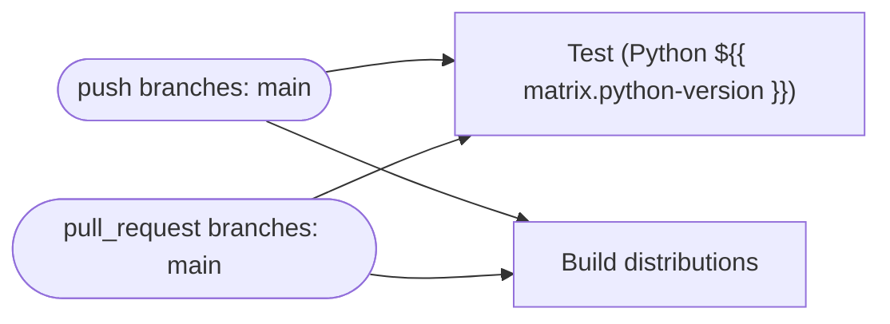
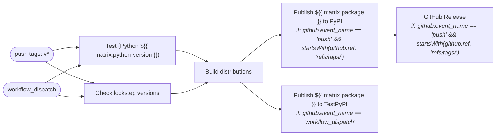

### CI (`.github/workflows/ci.yml`)

```mermaid
flowchart LR
  trigger_0(["push branches: main"])
  trigger_1(["pull_request branches: main"])
  test["Test (Python ${{ matrix.python-version }})"]
  build["Build distributions"]
  trigger_0 --> test
  trigger_1 --> test
  trigger_0 --> build
  trigger_1 --> build
```

### Publish (`.github/workflows/publish.yml`)

```mermaid
flowchart LR
  trigger_0(["push tags: v*"])
  trigger_1(["workflow_dispatch"])
  test["Test (Python ${{ matrix.python-version }})"]
  check_version["Check lockstep versions"]
  build["Build distributions"]
  publish_to_pypi["Publish ${{ matrix.package }} to PyPI<br/><i>if: github.event_name == 'push' && startsWith(github.ref, 'refs/tags/')</i>"]
  publish_to_testpypi["Publish ${{ matrix.package }} to TestPyPI<br/><i>if: github.event_name == 'workflow_dispatch'</i>"]
  github_release["GitHub Release<br/><i>if: github.event_name == 'push' && startsWith(github.ref, 'refs/tags/')</i>"]
  trigger_0 --> test
  trigger_1 --> test
  trigger_0 --> check_version
  trigger_1 --> check_version
  test --> build
  check_version --> build
  build --> publish_to_pypi
  build --> publish_to_testpypi
  publish_to_pypi --> github_release
```

